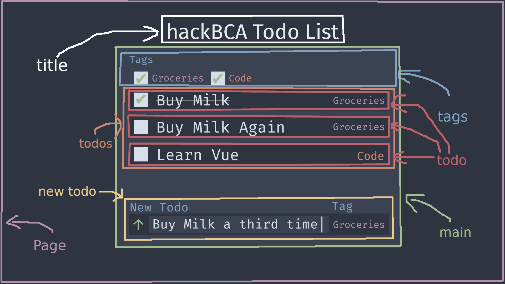
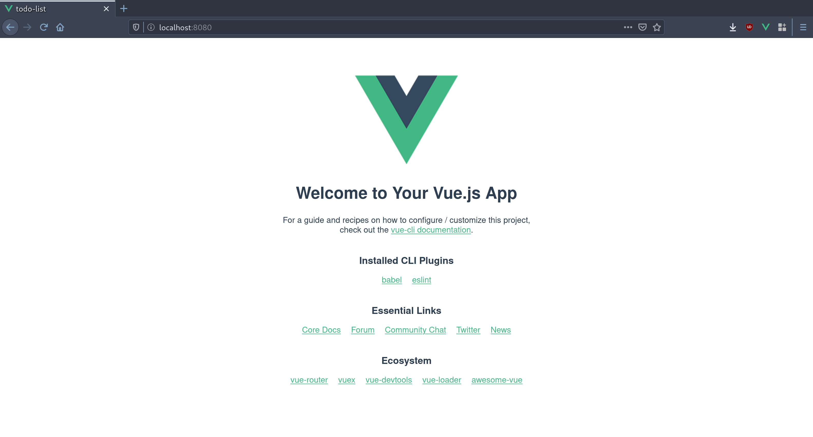

# A (briefish) intro to VueJS

hackBCA V, 2020

Aidan Glickman

[aidg.dev](http://aidg.dev)

## `Welcome`

Welcome to this VueJS tutorial. This repo is meant as a guide for the workshop I am teaching at hackBCA V, but you could probably follow along from the code examples and this document.

In this tutorial, we will be learning VueJS by jumping right in and doing a project. We will be building and continuously improving a todo list application as an example.

## `$ wtf vue`

```sh
$ wtf vue
VUE: a progressive framework for building user interfaces
```

Essentially, it is a really popular javascript framework for building UIs and frontend apps.

## `requirements`

### `knowledge`


If you are taking this course, I assume you have some basic web development knowledge. Specifically, I assume you possess the following skills:

- HTML
  - Vue components essentially look like glorified HTML, so this will be crucial
- **NOT STRICTLY NECESSARY:** CSS
  - We are going to want to make our websites pretty, so you are going to want to know CSS (I will probably be using SCSS during this course, but you should be able to understand fine just knowing CSS)
- JS
  - Know the fundamentals (conditionals, data types, arrays, objects, etc.)
  - **NOT STRICTLY NECESSARY:** There will be ES6 syntax in this course, so that would be useful as well (and arrow functions)
  - **NOT STRICTLY NECESSARY:** `async/await`? Might not get to this, but it will change the way you use javascript and is a good thing to learn

### `tools`

To go through this course, you will need to have a few things installed ahead of time.

- **WINDOWS ONLY:** [git-bash](https://git-scm.com/downloads) or [WSL](https://docs.microsoft.com/en-us/windows/wsl/install-win10) if you don't want to deal with actually developing on Windows.
- [nodeJS](https://nodejs.org/en/)
  - :black_square_button: If you are on Windows then download it from the website. (You could also use something like Chocolatey if you are in to that.)
  - :apple: If you are on MacOS I highly recommend using [homebrew](https://brew.sh/) and running `brew install node`
  - :penguin: If you are on linux just install from your package manager
    - :arrow_up: Arch: `pacman -S nodejs npm`
    - :red_circle: Ubuntu: `apt install -y nodejs`
    - :fish: Gentoo: Lol you don't need my help (`emerge nodejs`)
- **OPTIONAL:** [Yarn](https://classic.yarnpkg.com/en/)
  - I just prefer `yarn` to `npm` for package management, but it isn't required. Any `yarn` commands used in this documentation can be replaced with their `npm` equivalents.
- **OPTIONAL:** It is also very helpful to have a vue extension in your text editor of choice, as you get nice features like intellisense and syntax highlighting
  - :gem: VS Code: Vue provides an extenison called [Vetur](https://github.com/vuejs/vetur) for Vue language support.
  - :heavy_check_mark: Vim: I recommend [vim-vue-plugin] if you are using Vim.
  - :twisted_rightwards_arrows: Sublime Text: Vue provides a package called [Vue Syntax Highlight](https://github.com/vuejs/vue-syntax-highlight) for Vue language support.
  - :atom: Atom: Vue doesn't seem to have an official Atom package, but [language-vue](https://atom.io/packages/language-vue) has a lot of downloads.
- [Vue devtools](https://github.com/vuejs/vue-devtools)
  - Install the relevant extension for whatever browser you use
    - :radioactive: [Chrome Extension](https://chrome.google.com/webstore/detail/vuejs-devtools/nhdogjmejiglipccpnnnanhbledajbpd)
    - :fire: [Firefox Addon](https://addons.mozilla.org/en-US/firefox/addon/vue-js-devtools/)
    - If you don't use Firefox or something Chromium based, then you can also use the [standalone electron app](https://github.com/vuejs/vue-devtools/blob/dev/packages/shell-electron) (Looking at you, guy who thinks he's cool because he uses QuteBrowser)
- [VueCLI](https://cli.vuejs.org/)
  - This is the tool we will use to generate all of the boilerplate for our Vue projects
  - install with `yarn global add @vue/cli` or `npm i -g @vue.cli` if you didn't install yarn

## `intro`

### `$ diff vue {everythingelse}`

Why are we learning Vue instead of another framework like React or Angular?

1. Lower learning curve than other frameworks
1. Really fast and light
1. Increasingly popular
1. I'm better at it

### `structure`

If you have learned basic web development in the past, you may remember the "Seperation of Concerns" paradigm, where you split up your HTML, CSS, and JS in to different files. Throw that idea away. Now. :smile:

#### `components`


VueJS works on the "component" model, where instead of seperating things based on their function (layout, style, control) we seperate things in to little chunks called components, which we can often reuse.

Components have each of the three things we use in a web app within them, making them portable and easy to edit. Here is what a basic Vue component looks like:

```html
<template>
  <h1>Hi! I'm a Vue component called {{title}}!</h1>
</template>

<script>
  export default {
    name: 'Example Vue Component',
    props: ['title'],
  };
</script>

<style lang="scss" scoped>
  h1 {
    color: red;
  }
</style>
```

For a full Vue app, we are essentially just sticking a bunch of components together with some overhead to make a complete thing.

## `plans`

Now that we understand that Vue is made up of components, let's plan out our application on a component level.

Our application will probably end up looking something like this: (Not exactly, this is just a mockup)


Now let's plan out what our components:



Now that we have a concrete plan, we are ready to jump in and start building our project!

## `vue create`

Now that we have a basic understanding of what Vue is, let's jump right in and start writing our first app!

Start by navigating to wherever you want your project to live.

```bash
cd ~/Documents # Or wherever you want to put your project
```

Then we can use VueCLI to create a project for us.

```bash
vue create todo-list
```

This command will give us a menu to guide us through all of the boilerplate that our Vue application will need. This includes configuring important tools like babel and webpack for us, so that we don't need to deal with those and can get right in to the fun stuff.

```bash
? Please pick a preset: Manually select features
? Check the features needed for your project: Babel, CSS Pre-processors, Linter
? Pick a CSS pre-processor (PostCSS, Autoprefixer and CSS Modules are supported by default): Sass/SCSS (with dart-sass)
? Pick a linter / formatter config: Prettier
? Pick additional lint features: (Press <space> to select, <a> to toggle all, <i> to invert selection)Lint on save
? Where do you prefer placing config for Babel, ESLint, etc.? In dedicated config files
? Save this as a preset for future projects? No
```

These are the settings that we will use for this project, so go through the menu and select the same options (if you would like to save it as a preset that's fine.)

Now that we have created our project, we can actually go in and run it right away! Sadly, VueCLI did not read our minds and write our whole project for us, but it did add some sample code to get us started. Let's go ahead and get our development environment up!

```bash
cd todo-list
yarn serve
```

**NOTE:** From here on out I will assume that you are in your `todo-list` directory in every command.

Now if we follow the link in our terminal output, we can see a webpage that looks something like this:


**NOTE:** This is a good time to open up your `todo-list` directory in your text editor.

Cool! Just like that we have a development environment. And the coolest thing is it will update any time we make a change to our source code!

## A bit more setup

That example page is great and all, but we don't really need it for our project. Let's go ahead and strip out the example code.

```bash
rm src/components/HelloWorld.vue
```

Then we can move over to our `src/App.vue` file, and strip it down. After deleting the styling and references to `HelloWorld`, you should end up with a barebones component that looks something like this:

```html
<template>
  <div id="app"></div>
</template>

<script>
  export default {
    name: 'App',
  };
</script>

<style lang="scss"></style>
```

## Interlude: Different programming approaches

Now that we have our web page ready, there are some decisions we have to make about our coding style. Most importantly, what order are we going to do things? We can either try to build our application from the top down - starting with the root components and working our way down to the lower level ones - or from the bottom up - essentially the opposite.


In this project I will be following a bottom up approach, so we will start with our most basic components and put them together at the end.

## `todo`

Let's get started with our simplest component, the `todo` component. This component will be a small piece that will display each one of our todos. It will then be rendered in a list so that all of our todos are shown.

start by creating a `todo.vue` file in `/src/components`

```bash
touch src/components/todos.vue
```
